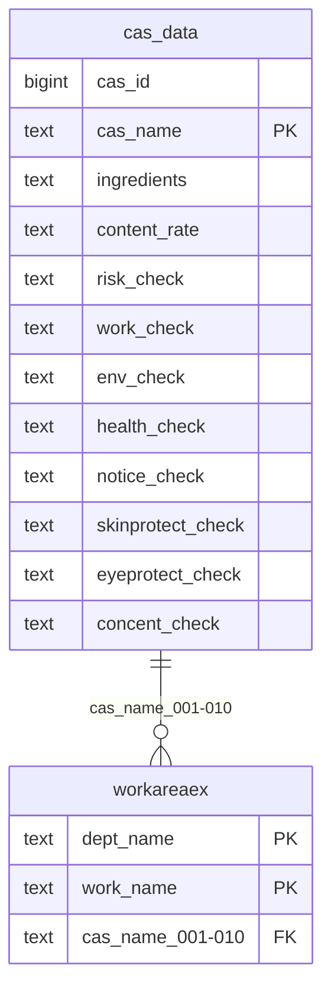

# cas_data（CAS情報）

## ER図

## 概要

CAS（Chemical Abstracts Service）情報を管理するテーブル。

## テーブル定義

| No | カラム名（論理） | カラム名（物理） | データ型 | NULL | キー | 説明 |
|----|-----------------|-----------------|----------|------|------|------|
| 1 | CAS情報ID | cas_id | bigint | NO | - | CAS情報ID（自動採番） |
| 2 | CAS名称 | cas_name | text | NO | PK | CAS名称 |
| 3 | 成分 | ingredients | text | YES | - | 成分 |
| 4 | 含有率 | content_rate | text | YES | - | 含有率 |
| 5 | リスクアセスメント要 | risk_check | text | YES | - | リスクアセスメント要 |
| 6 | 作業記録要 | work_check | text | YES | - | 作業記録要 |
| 7 | 環境測定要 | env_check | text | YES | - | 環境測定要 |
| 8 | 健康診断要 | health_check | text | YES | - | 健康診断要 |
| 9 | 掲示物要 | notice_check | text | YES | - | 掲示物要 |
| 10 | 皮膚保護具要 | skinprotect_check | text | YES | - | 皮膚保護具要 |
| 11 | 目保護具要 | eyeprotect_check | text | YES | - | 目保護具要 |
| 12 | 濃度基準要 | concent_check | text | YES | - | 濃度基準要 |
