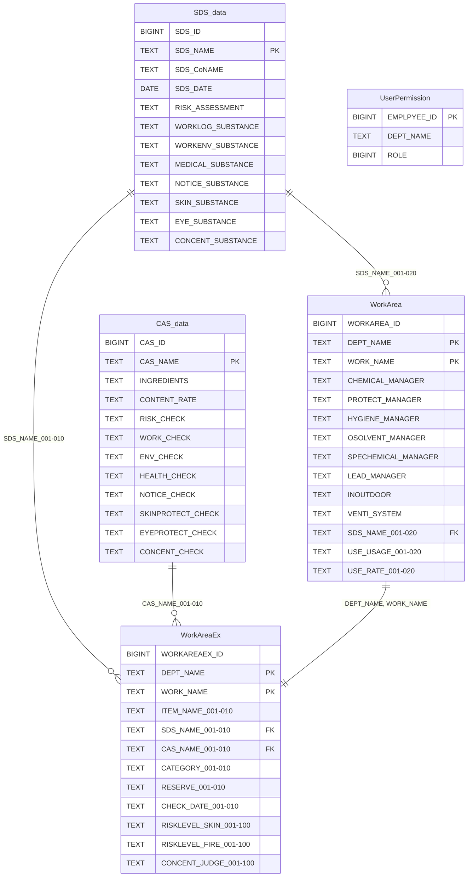

# DB設計

## 基本情報

| 項目 | 値 |
|------|-----|
| データベース | PostgreSQL 18.1 |
| スキーマ名 | CS_SCHEMA |
| データベース名 | Chemical_Substance |

## テーブル一覧

| No | テーブル名（日本語） | テーブル名（物理） | 説明 |
|----|---------------------|-------------------|------|
| 1 | [SDS情報](./sds-data) | SDS_data | SDS情報を管理する |
| 2 | [CAS情報](./cas-data) | CAS_data | CAS情報を管理する |
| 3 | [作業場所](./workarea) | WorkArea | 作業場所データを管理する |
| 4 | [作業場拡張データ](./workarea-ex) | WorkAreaEx | 作業場所データを管理する（安衛G管理対象外データ） |
| 5 | [ユーザ権限](./user-permission) | UserPermission | ユーザの権限情報を管理する |

## ER図

