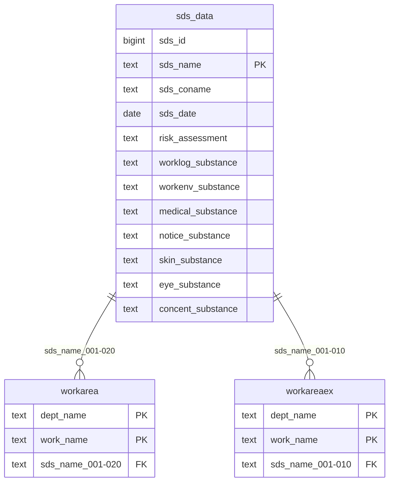

# sds_data（SDS情報）

## ER図

## 概要

SDS（安全データシート）情報を管理するテーブル。

## テーブル定義

| No | カラム名（論理） | カラム名（物理） | データ型 | NULL | キー | 説明 |
|----|-----------------|-----------------|----------|------|------|------|
| 1 | SDS情報ID | sds_id | bigint | NO | - | SDS情報ID（自動採番） |
| 2 | 製品名称 | sds_name | text | NO | PK | 製品名称 |
| 3 | 製造会社 | sds_coname | text | YES | - | 製造会社 |
| 4 | SDS発行・更新日 | sds_date | date | YES | - | SDS発行・更新日 |
| 5 | リスクアセスメント対象物 | risk_assessment | text | YES | - | リスクアセスメント対象物 |
| 6 | 作業記録対象物質 | worklog_substance | text | YES | - | 作業記録対象物質 |
| 7 | 作業環境測定物質 | workenv_substance | text | YES | - | 作業環境測定物質 |
| 8 | 特殊健康診断物質 | medical_substance | text | YES | - | 特殊健康診断物質 |
| 9 | 掲示物物質 | notice_substance | text | YES | - | 掲示物物質 |
| 10 | 皮膚など障害化学物質 | skin_substance | text | YES | - | 皮膚など障害化学物質 |
| 11 | 皮膚など障害化学物質（眼） | eye_substance | text | YES | - | 皮膚など障害化学物質（眼） |
| 12 | 濃度基準値設定物質 | concent_substance | text | YES | - | 濃度基準値設定物質 |
