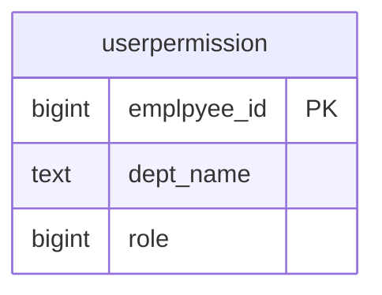

# userpermission（ユーザ権限）

## ER図

## 概要

ユーザの権限情報を管理するテーブル。

## テーブル定義

| No | カラム名（論理） | カラム名（物理） | データ型 | NULL | キー | 説明 |
|----|-----------------|-----------------|----------|------|------|------|
| 1 | 従業員番号 | emplpyee_id | bigint | NO | PK | 従業員番号 |
| 2 | 部門 | dept_name | text | YES | - | 部門 |
| 3 | 権限 | role | bigint | YES | - | 権限 |
