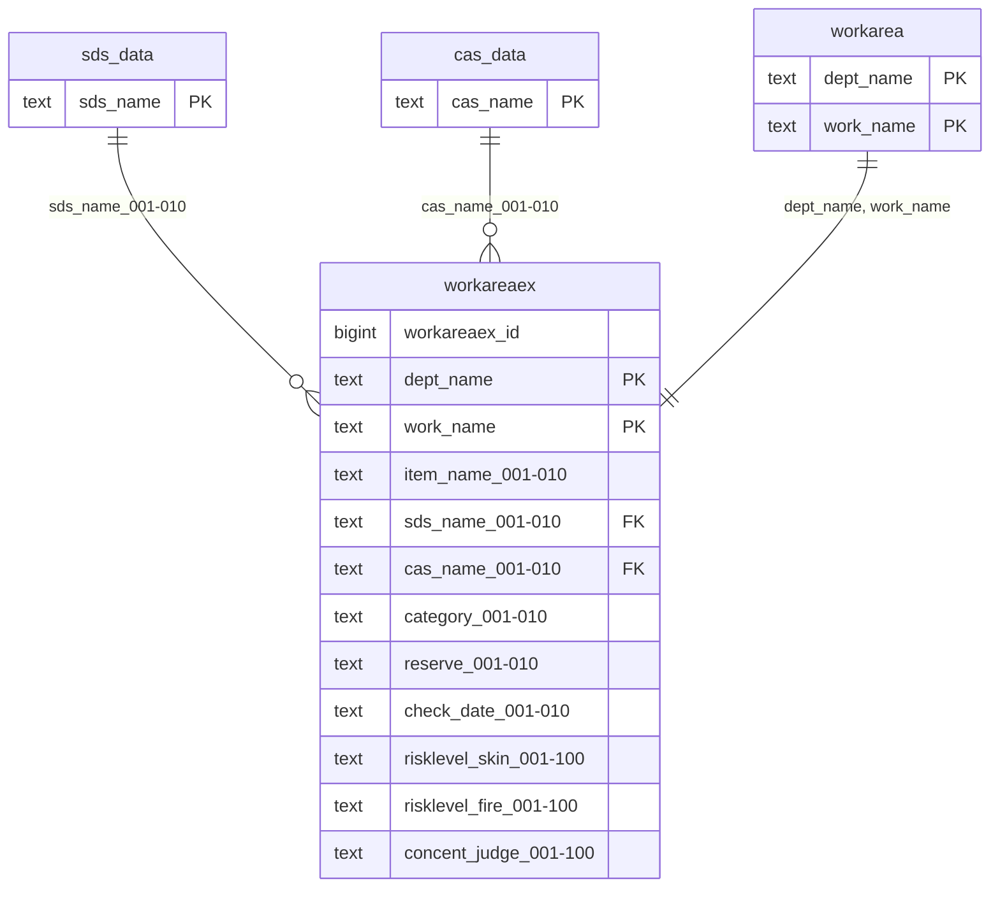

# workareaex（作業場拡張データ）

## ER図

## 概要

作業場所の拡張データを管理するテーブル（安衛G管理対象外データ）。

## テーブル定義

| No | カラム名（論理） | カラム名（物理） | データ型 | NULL | キー | 説明 |
|----|-----------------|-----------------|----------|------|------|------|
| 1 | 作業場拡張ID | workareaex_id | bigint | NO | - | 作業場拡張ID（自動採番） |
| 2 | 部門 | dept_name | text | NO | PK | 部門 |
| 3 | 作業場所 | work_name | text | NO | PK | 作業場所 |
| 4-13 | 項目 | item_name_001〜010 | text | YES | - | 項目（特化物/有機溶剤/粉じん/騒音/鉛） |
| 14-23 | 製品名称 | sds_name_001〜010 | text | YES | FK | 製品名称 |
| 24-33 | 物質名 | cas_name_001〜010 | text | YES | FK | 物質名 |
| 34-43 | 作業環境測定結果管理区分 | category_001〜010 | text | YES | - | 作業環境測定結果管理区分 |
| 44-53 | 予備 | reserve_001〜010 | text | YES | - | 予備（将来対応：未使用） |
| 54-63 | 作業環境測定実施日 | check_date_001〜010 | text | YES | - | 作業環境測定実施日 |
| 64-163 | リスクレベル（吸入＋経皮） | risklevel_skin_001〜100 | text | YES | - | リスクレベル（吸入＋経皮） |
| 164-263 | リスクレベル（爆発・火災等） | risklevel_fire_001〜100 | text | YES | - | リスクレベル（爆発・火災等） |
| 264-363 | 濃度基準値判定 | concent_judge_001〜100 | text | YES | - | 濃度基準値判定 |

**主キー**: dept_name, work_name
