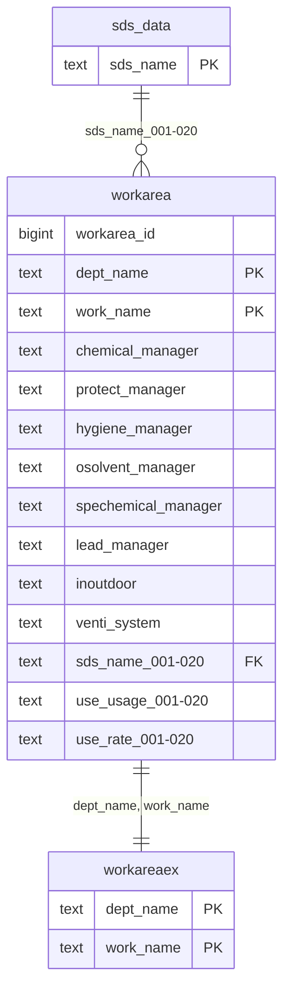

# workarea（作業場所）

## ER図

## 概要

作業場所と管理者情報を管理するテーブル。

## テーブル定義

| No | カラム名（論理） | カラム名（物理） | データ型 | NULL | キー | 説明 |
|----|-----------------|-----------------|----------|------|------|------|
| 1 | 作業場所ID | workarea_id | bigint | NO | - | 作業場所ID（自動採番） |
| 2 | 部門 | dept_name | text | NO | PK | 部門 |
| 3 | 作業場所 | work_name | text | NO | PK | 作業場所 |
| 4 | 化学物質管理者 | chemical_manager | text | YES | - | 化学物質管理者 |
| 5 | 保護具着用管理責任者 | protect_manager | text | YES | - | 保護具着用管理責任者 |
| 6 | 衛生管理者 | hygiene_manager | text | YES | - | 衛生管理者 |
| 7 | 有機溶剤作業主任者 | osolvent_manager | text | YES | - | 有機溶剤作業主任者 |
| 8 | 特定化学物質作業主任者 | spechemical_manager | text | YES | - | 特定化学物質作業主任者 |
| 9 | 鉛作業主任者 | lead_manager | text | YES | - | 鉛作業主任者 |
| 10 | 屋内／屋外 | inoutdoor | text | YES | - | 屋内／屋外 |
| 11 | 換気装置 | venti_system | text | YES | - | 換気装置 |
| 12-31 | 保有製品（製品名称） | sds_name_001〜020 | text | YES | FK | 保有製品（製品名称） |
| 32-51 | 保有製品（使用用途） | use_usage_001〜020 | text | YES | - | 保有製品（使用用途） |
| 52-71 | 保有製品（使用量） | use_rate_001〜020 | text | YES | - | 保有製品（使用量） |

**主キー**: dept_name, work_name
