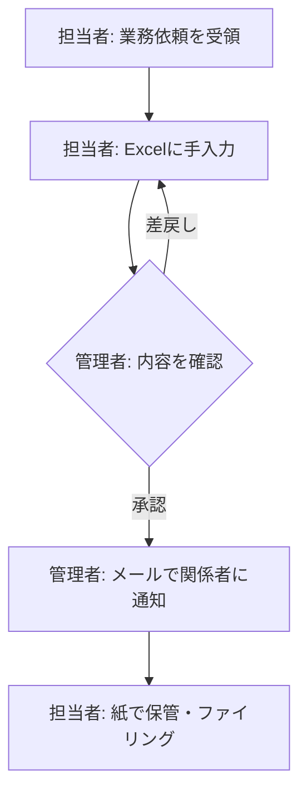
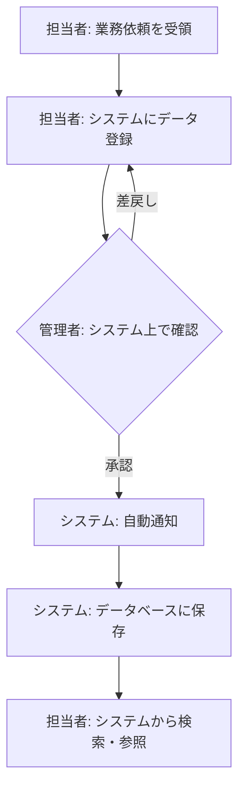
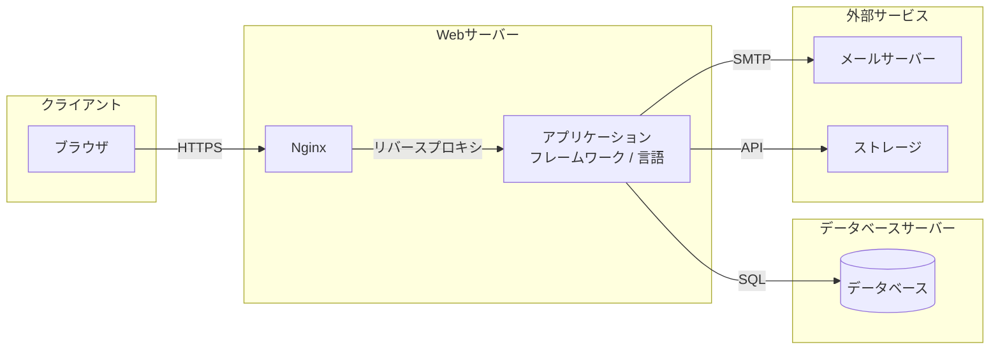

# 要件定義

## プロジェクトの背景と目的

なぜこのシステムを開発するのか、どのような課題を解決したいのかといったプロジェクトのゴールを記載する。

- **背景**: {現状の課題や業務上の問題点}
- **目的**: {システム導入により実現したいこと}
- **期待する効果**: {業務改善・コスト削減などの具体的な効果}

## システムのスコープ（作業範囲）

プロジェクトで対応する作業範囲、反対に含まれない作業範囲を明確にする。

### 対象範囲

- {対応する業務・機能}

### 対象外

- {今回のプロジェクトでは対応しない業務・機能}

## 対象ユーザー

- {ユーザー種別1}: {役割・利用目的}
- {ユーザー種別2}: {役割・利用目的}

## 業務フロー

現行業務およびシステム導入後の業務の流れを図示する。

### 現行業務フロー（As-Is）

### システム導入後の業務フロー（To-Be）

## 機能要件

システムに求める具体的な機能を定義する。詳細は[機能一覧](./features.md)を参照。

| 機能カテゴリ | 概要 |
|-------------|------|
| {カテゴリ名} | {概要説明} |

## 非機能要件

システムの性能や品質に関する要件を定義する。

### 性能・拡張性

| 項目 | 要件 |
|------|------|
| 同時接続数 | {想定数} |
| 応答速度 | {目標値（例: 3秒以内）} |
| データ量 | {想定レコード数・増加見込み} |
| 将来的なユーザー数 | {増加見込み} |

### セキュリティ

| 項目 | 要件 |
|------|------|
| 認証方式 | {ログイン認証 / SSO / 不要 など} |
| アクセス制御 | {ロールベース / IP制限 など} |
| 通信暗号化 | {HTTPS必須 / 不要 など} |
| 情報漏洩対策 | {具体的な対策} |

### 可用性・保守性

| 項目 | 要件 |
|------|------|
| 稼働率 | {目標値（例: 99.9%）} |
| 障害復旧時間 | {目標値（例: 4時間以内）} |
| バックアップ | {頻度・保持期間} |
| メンテナンス | {計画停止の許容範囲} |

### 操作性・ユーザビリティ

| 項目 | 要件 |
|------|------|
| 対応言語 | {日本語 / 多言語対応 など} |
| レスポンシブ対応 | {PC専用 / スマートフォン対応 など} |
| アクセシビリティ | {対応レベル} |

## 稼働環境要件

システムが動作する環境を定義する。

### クライアント環境

| 項目 | 要件 |
|------|------|
| OS | {Windows / macOS など} |
| ブラウザ | {Chrome / Edge / Safari など} |

### サーバー環境

| 項目 | 要件 |
|------|------|
| OS | {Linux / Windows Server など} |
| フロントエンド | {フレームワーク / 言語} |
| バックエンド | {フレームワーク / 言語} |
| データベース | {RDBMS名・バージョン} |
| ミドルウェア | {Webサーバー・キャッシュなど} |

### システム構成図

