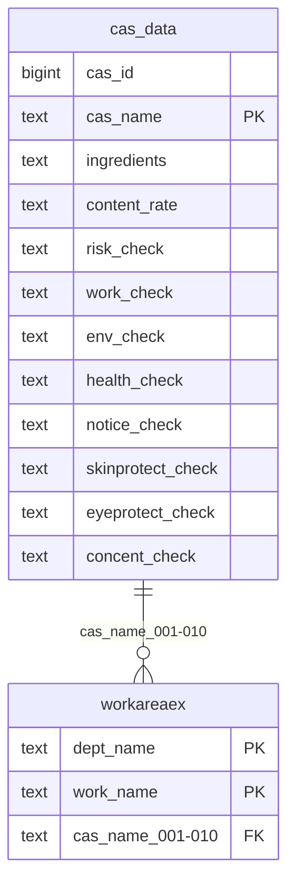

# cas_data (Thông tin CAS)

## Sơ đồ ER

## Tổng quan

Bảng quản lý thông tin CAS (Chemical Abstracts Service).

## Định nghĩa bảng

| No | Tên cột (Logic) | Tên cột (Vật lý) | Kiểu dữ liệu | NULL | Key | Mô tả |
|----|-----------------|------------------|--------------|------|-----|-------|
| 1 | ID thông tin CAS | cas_id | bigint | NO | - | ID thông tin CAS (tự động) |
| 2 | Tên CAS | cas_name | text | NO | PK | Tên CAS |
| 3 | Thành phần | ingredients | text | YES | - | Thành phần |
| 4 | Tỷ lệ hàm lượng | content_rate | text | YES | - | Tỷ lệ hàm lượng |
| 5 | Yêu cầu đánh giá rủi ro | risk_check | text | YES | - | Yêu cầu đánh giá rủi ro |
| 6 | Yêu cầu ghi chép công việc | work_check | text | YES | - | Yêu cầu ghi chép công việc |
| 7 | Yêu cầu đo môi trường | env_check | text | YES | - | Yêu cầu đo môi trường |
| 8 | Yêu cầu khám sức khỏe | health_check | text | YES | - | Yêu cầu khám sức khỏe |
| 9 | Yêu cầu thông báo | notice_check | text | YES | - | Yêu cầu thông báo |
| 10 | Yêu cầu bảo vệ da | skinprotect_check | text | YES | - | Yêu cầu bảo vệ da |
| 11 | Yêu cầu bảo vệ mắt | eyeprotect_check | text | YES | - | Yêu cầu bảo vệ mắt |
| 12 | Yêu cầu nồng độ tiêu chuẩn | concent_check | text | YES | - | Yêu cầu nồng độ tiêu chuẩn |
