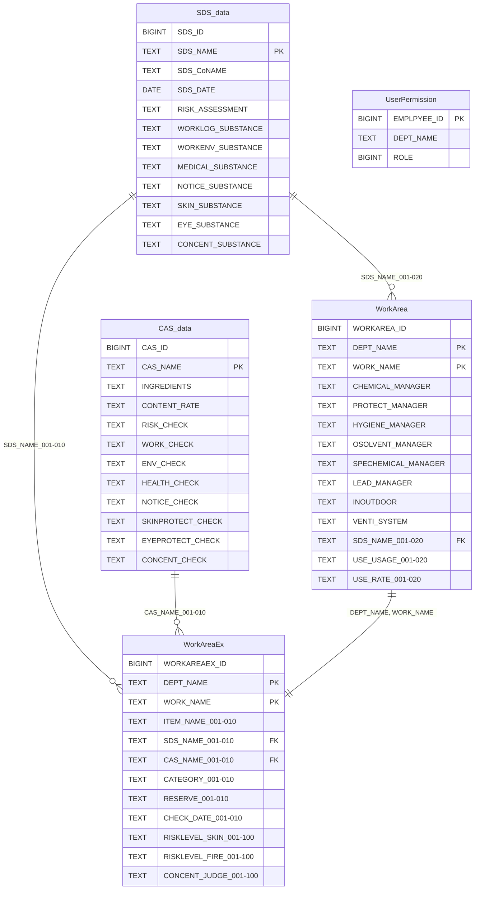

# Thiết kế DB

## Thông tin cơ bản

| Mục | Giá trị |
|-----|---------|
| Cơ sở dữ liệu | PostgreSQL 18.1 |
| Tên Schema | CS_SCHEMA |
| Tên Database | Chemical_Substance |

## Danh sách bảng

| No | Tên bảng (Tiếng Nhật) | Tên bảng (Vật lý) | Mô tả |
|----|----------------------|-------------------|-------|
| 1 | [SDS情報](./sds-data) | SDS_data | Quản lý thông tin SDS |
| 2 | [CAS情報](./cas-data) | CAS_data | Quản lý thông tin CAS |
| 3 | [作業場所](./workarea) | WorkArea | Quản lý dữ liệu nơi làm việc |
| 4 | [作業場拡張データ](./workarea-ex) | WorkAreaEx | Quản lý dữ liệu mở rộng nơi làm việc |
| 5 | [ユーザ権限](./user-permission) | UserPermission | Quản lý quyền người dùng |

## Sơ đồ ER

