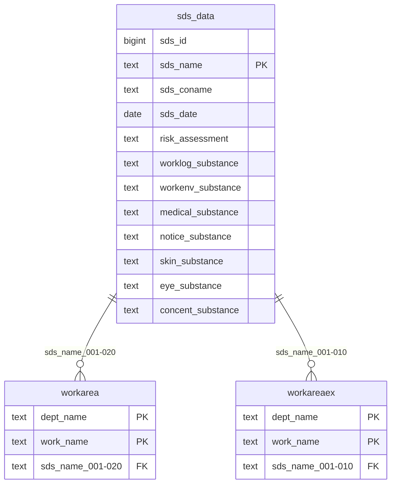

# sds_data (Thông tin SDS)

## Sơ đồ ER

## Tổng quan

Bảng quản lý thông tin SDS (Safety Data Sheet - Bảng dữ liệu an toàn).

## Định nghĩa bảng

| No | Tên cột (Logic) | Tên cột (Vật lý) | Kiểu dữ liệu | NULL | Key | Mô tả |
|----|-----------------|------------------|--------------|------|-----|-------|
| 1 | ID thông tin SDS | sds_id | bigint | NO | - | ID thông tin SDS (tự động) |
| 2 | Tên sản phẩm | sds_name | text | NO | PK | Tên sản phẩm |
| 3 | Công ty sản xuất | sds_coname | text | YES | - | Công ty sản xuất |
| 4 | Ngày phát hành/cập nhật SDS | sds_date | date | YES | - | Ngày phát hành/cập nhật SDS |
| 5 | Đối tượng đánh giá rủi ro | risk_assessment | text | YES | - | Đối tượng đánh giá rủi ro |
| 6 | Chất đối tượng ghi chép công việc | worklog_substance | text | YES | - | Chất đối tượng ghi chép công việc |
| 7 | Chất đo môi trường làm việc | workenv_substance | text | YES | - | Chất đo môi trường làm việc |
| 8 | Chất khám sức khỏe đặc biệt | medical_substance | text | YES | - | Chất khám sức khỏe đặc biệt |
| 9 | Chất thông báo | notice_substance | text | YES | - | Chất thông báo |
| 10 | Chất hóa học gây hại da | skin_substance | text | YES | - | Chất hóa học gây hại da |
| 11 | Chất hóa học gây hại mắt | eye_substance | text | YES | - | Chất hóa học gây hại mắt |
| 12 | Chất thiết lập giá trị nồng độ tiêu chuẩn | concent_substance | text | YES | - | Chất thiết lập giá trị nồng độ tiêu chuẩn |
