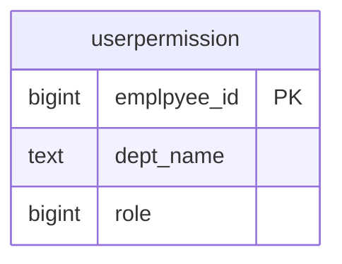

# userpermission (Quyền người dùng)

## Sơ đồ ER

## Tổng quan

Bảng quản lý thông tin quyền người dùng.

## Định nghĩa bảng

| No | Tên cột (Logic) | Tên cột (Vật lý) | Kiểu dữ liệu | NULL | Key | Mô tả |
|----|-----------------|------------------|--------------|------|-----|-------|
| 1 | Mã nhân viên | emplpyee_id | bigint | NO | PK | Mã nhân viên |
| 2 | Phòng ban | dept_name | text | YES | - | Phòng ban |
| 3 | Quyền | role | bigint | YES | - | Quyền |
