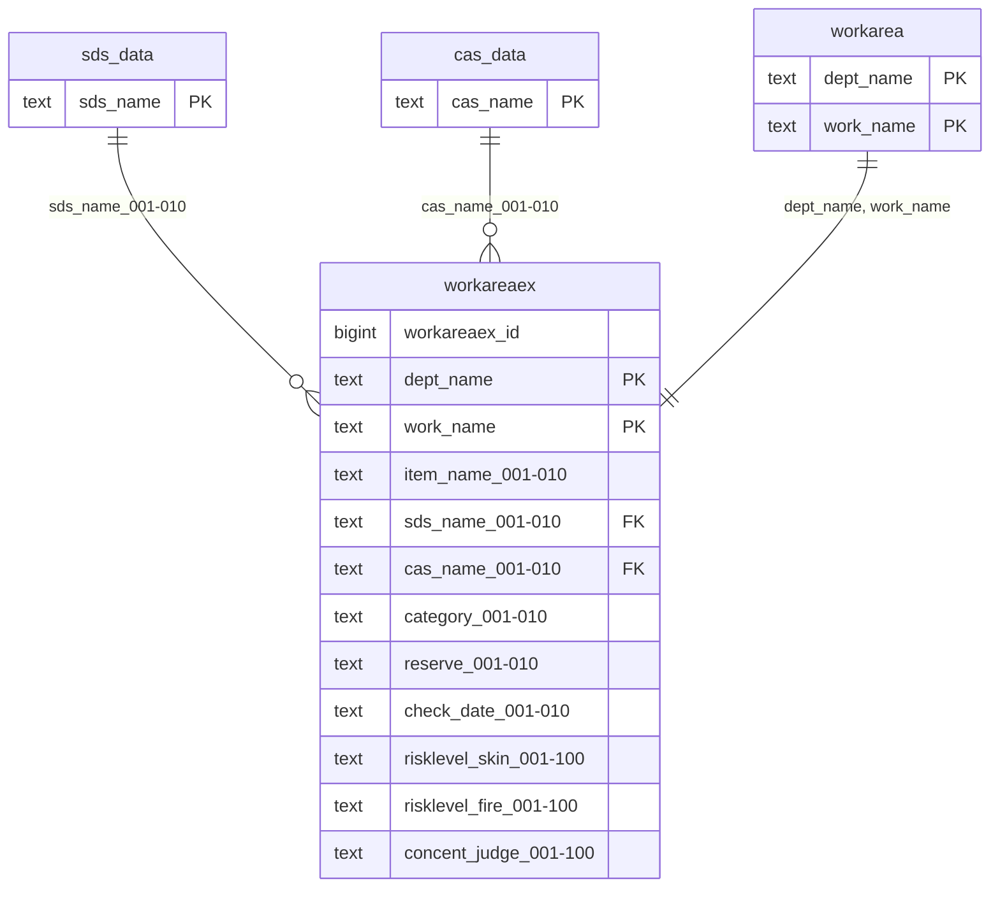

# workareaex (Dữ liệu mở rộng nơi làm việc)

## Sơ đồ ER

## Tổng quan

Bảng quản lý dữ liệu mở rộng nơi làm việc.

## Định nghĩa bảng

| No | Tên cột (Logic) | Tên cột (Vật lý) | Kiểu dữ liệu | NULL | Key | Mô tả |
|----|-----------------|------------------|--------------|------|-----|-------|
| 1 | ID mở rộng nơi làm việc | workareaex_id | bigint | NO | - | ID mở rộng nơi làm việc (tự động) |
| 2 | Phòng ban | dept_name | text | NO | PK | Phòng ban |
| 3 | Nơi làm việc | work_name | text | NO | PK | Nơi làm việc |
| 4-13 | Mục | item_name_001〜010 | text | YES | - | Mục (Đặc hóa/Dung môi hữu cơ/Bụi/Tiếng ồn/Chì) |
| 14-23 | Tên sản phẩm | sds_name_001〜010 | text | YES | FK | Tên sản phẩm |
| 24-33 | Tên chất | cas_name_001〜010 | text | YES | FK | Tên chất |
| 34-43 | Phân loại quản lý kết quả đo môi trường | category_001〜010 | text | YES | - | Phân loại quản lý kết quả đo môi trường |
| 44-53 | Dự phòng | reserve_001〜010 | text | YES | - | Dự phòng (Tương lai: chưa sử dụng) |
| 54-63 | Ngày đo môi trường làm việc | check_date_001〜010 | text | YES | - | Ngày đo môi trường làm việc |
| 64-163 | Mức rủi ro (Hít+Qua da) | risklevel_skin_001〜100 | text | YES | - | Mức rủi ro (Hít+Qua da) |
| 164-263 | Mức rủi ro (Nổ/Cháy) | risklevel_fire_001〜100 | text | YES | - | Mức rủi ro (Nổ/Cháy) |
| 264-363 | Đánh giá nồng độ tiêu chuẩn | concent_judge_001〜100 | text | YES | - | Đánh giá nồng độ tiêu chuẩn |

**Khóa chính**: dept_name, work_name
