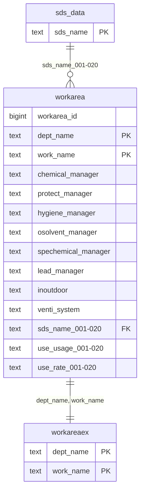

# workarea (Nơi làm việc)

## Sơ đồ ER

## Tổng quan

Bảng quản lý nơi làm việc và thông tin quản lý.

## Định nghĩa bảng

| No | Tên cột (Logic) | Tên cột (Vật lý) | Kiểu dữ liệu | NULL | Key | Mô tả |
|----|-----------------|------------------|--------------|------|-----|-------|
| 1 | ID nơi làm việc | workarea_id | bigint | NO | - | ID nơi làm việc (tự động) |
| 2 | Phòng ban | dept_name | text | NO | PK | Phòng ban |
| 3 | Nơi làm việc | work_name | text | NO | PK | Nơi làm việc |
| 4 | Người quản lý hóa chất | chemical_manager | text | YES | - | Người quản lý hóa chất |
| 5 | Người chịu trách nhiệm thiết bị bảo hộ | protect_manager | text | YES | - | Người chịu trách nhiệm thiết bị bảo hộ |
| 6 | Người quản lý vệ sinh | hygiene_manager | text | YES | - | Người quản lý vệ sinh |
| 7 | Trưởng nhóm dung môi hữu cơ | osolvent_manager | text | YES | - | Trưởng nhóm dung môi hữu cơ |
| 8 | Trưởng nhóm hóa chất đặc biệt | spechemical_manager | text | YES | - | Trưởng nhóm hóa chất đặc biệt |
| 9 | Trưởng nhóm chì | lead_manager | text | YES | - | Trưởng nhóm chì |
| 10 | Trong nhà/Ngoài trời | inoutdoor | text | YES | - | Trong nhà/Ngoài trời |
| 11 | Thiết bị thông gió | venti_system | text | YES | - | Thiết bị thông gió |
| 12-31 | Sản phẩm sở hữu (Tên sản phẩm) | sds_name_001〜020 | text | YES | FK | Sản phẩm sở hữu (Tên sản phẩm) |
| 32-51 | Sản phẩm sở hữu (Mục đích sử dụng) | use_usage_001〜020 | text | YES | - | Sản phẩm sở hữu (Mục đích sử dụng) |
| 52-71 | Sản phẩm sở hữu (Lượng sử dụng) | use_rate_001〜020 | text | YES | - | Sản phẩm sở hữu (Lượng sử dụng) |

**Khóa chính**: dept_name, work_name
